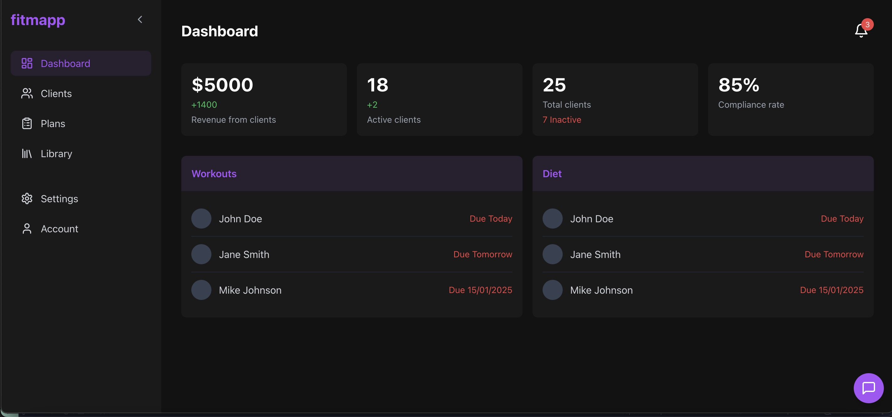
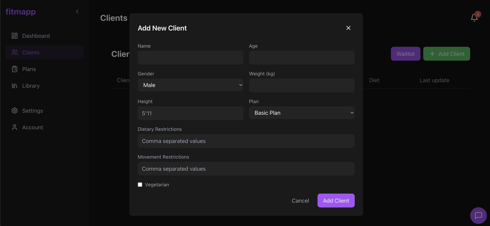
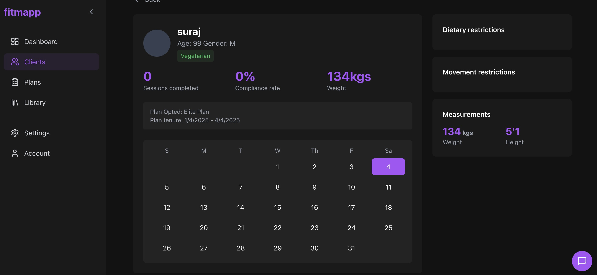

# Fitmapp Website

## Figma
- Figma Url: https://www.figma.com/design/CAPCgFmHShWT4M8KUEWemF/Final-Pages?m=auto&t=DBmL68qvQIX7rYyC-1   
- Navigate to Desktop Application in the Pages

## Run
### To run the project do the following
- Install and setup vscode, Nodejs, React, npm.
- ```git clone https://github.com/tanish1608/Fitmapp-website.git```
- ```cd Fitmapp-website```
- ```npm install ```
- ```npm run dev ```


## Contribution Guidelines  

Thank you for contributing to this project! To ensure smooth collaboration, please follow these guidelines:  

### Branching  
- Always create a new branch for your work.  

### Pushing Changes  
- **Do not push directly** to the `main` branch.  
- Push your changes to your feature or bugfix branch.  

### Pull Requests (PRs)  
- Submit a Pull Request (PR) when your changes are ready for review.  
- Include a clear and concise description of the changes and their purpose.  
- Assign at least one reviewer to your PR.  

### Code Reviews  
- All changes must be reviewed and approved before merging.  
- Be open to feedback and willing to revise your code as needed.  

### Commit Messages  
- Write meaningful and descriptive commit messages.  
- Use the following format for commits:  

### Testing  
- Ensure your code passes all tests before submitting a PR.  
- Write tests for any new functionality.  

### Merge Strategy  
- Use **Squash and Merge** or **Rebase and Merge** to keep the commit history clean.  
- Only maintainers or designated team members are allowed to merge PRs.  

### Communication  
- Use the repository’s issue tracker to propose features or report bugs.  
- Be respectful and professional in all communications.  

### Automation and Rules Enforcement  
- Branch protection rules are enabled to prevent direct pushes to the `main` branch.  
- Automated checks (e.g., tests, linting) must pass before merging PRs.  

By following these guidelines, we can ensure a productive and collaborative development process. Thank you!

## Images




